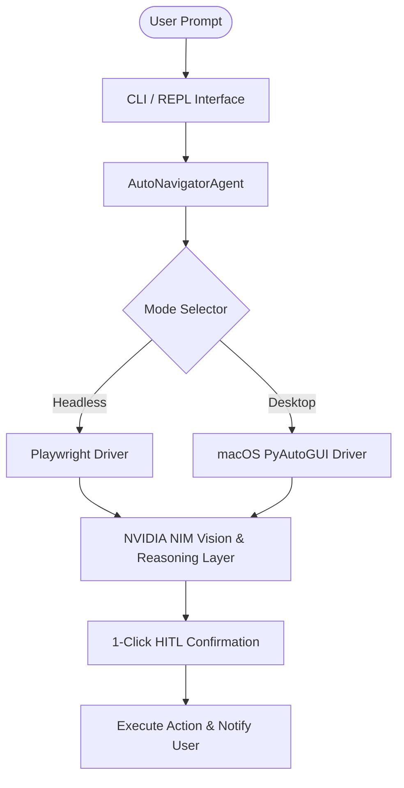

# 🧭 Auto-Navigator

> **Intelligent Autonomous Agent for Headless & Desktop Navigation powered by NVIDIA NIM Vision Models and 1-Click Human-in-the-Loop Verification.**

---

## 🌟 Key Features

1. **Dual Execution Modes**:
   - **Headless / Background Mode (Non-intrusive)**: Runs Playwright with persistent session storage so you can multitask without the agent stealing your physical mouse or keyboard focus.
   - **Live OS Desktop Mode**: Uses macOS native screen capture and `pyautogui`/`pyobjc` to navigate any desktop application, Spotlight, or multi-window workflow.
2. **NVIDIA NIM Vision & Reasoning**:
   - Seamless integration with NVIDIA NIM endpoints (`meta/llama-3.2-90b-vision-instruct`, `meta/llama-3.2-11b-vision-instruct`, etc.) for visual element grounding, coordinate prediction, and contextual synthesis.
3. **1-Click Human-in-the-Loop (HITL) Safety**:
   - Before taking sensitive or public actions (like posting comments or making changes), Auto-Navigator pauses with a 1-click modal or CLI prompt (`[Approve]`, `[Edit]`, `[Reject]`).
4. **Pre-configured Workflows**:
   - **LinkedIn Workflow**: Searches contact (e.g. *Yash Rai*), views latest post & comments, synthesizes an authentic response with NVIDIA NIM, asks for 1-click approval, and posts.
   - **GitHub Workflow**: Locates repository (e.g. *op_celestia* by *overxpowered*), extracts clone URL, and copies directly to clipboard with audio & toast notification.
   - **Generic Autonomous Loop**: Arbitrary visual goal navigation.

---

## 🚀 Quick Start

### 1. Setup Environment
```bash
# Clone or navigate to the project
cd Auto-Navigator

# Create & activate virtual environment
python3.11 -m venv .venv
source .venv/bin/activate

# Install dependencies & Playwright browser
pip install -e .
python -m playwright install chromium
```

### 2. Configure NVIDIA NIM API Key
Copy the example environment file and add your key:
```bash
cp .env.example .env
```
Edit `.env`:
```ini
NVIDIA_API_KEY=nvapi-your-key-here
NVIDIA_BASE_URL=https://integrate.api.nvidia.com/v1
DEFAULT_VISION_MODEL=meta/llama-3.2-11b-vision-instruct
DEFAULT_EXECUTION_MODE=headless
```

---

## 💡 Usage Examples

### 1. LinkedIn Comment Flow
```bash
# Headless background mode
autonavigator "post comment on Yash Rai's latest post on LinkedIn"

# Or in desktop OS mode
autonavigator --mode desktop "comment on Yash Rai's latest post on LinkedIn"
```

### 2. GitHub Repo Copy Flow
```bash
# Search and copy repo to clipboard
autonavigator "copy op_celestia from github from overxpowered"
```

### 3. Interactive REPL Mode
```bash
autonavigator --interactive
```

---

## 🏗️ Architecture


